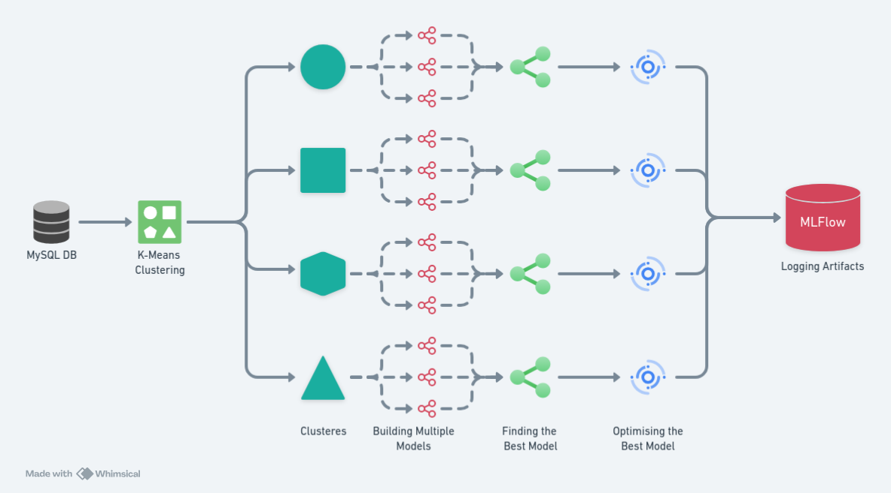

# Cement Strength Prediction Model

## Overview
This repository contains code for a machine learning project aimed at building a cement strength prediction model. 

### Problem Statement
Cement strength is a critical factor in construction and engineering projects. Predicting the strength accurately can lead to better quality control and resource management. This project aims to build a reliable model that can predict cement strength using historical data.

### Project Structure
The project structure is organized as follows:

- **`Prediction_Model/`**: Main directory for project code.
  - **`clustering/`**: Contains clustering algorithms.
  - **`DATA/`**: Stores raw and processed data.
  - **`file_operations/`**: Functions for file handling.
  - **`main.py`**: Entry point for project execution.
  - **`best_model_finder/`**: Finds the best model.
  - **`data_preprocessing/`**: Preprocesses data.
  - **`Application_Logs/`**: Stores application logs.
  - **`Models/`**: Trained machine learning models.
  - **`predict/`**: Makes predictions.
  - **`db_operations/`**: Handles database operations.
  - **`app_logging/`**: Manages application logging.
  - **`config/`**: Manages project configuration settings.
  - **`train_model/`**: Trains machine learning models.
  - **`data_ingestion/`**: Handles data ingestion.
  - **`data_validation_insertion/`**: Validates and inserts data.
  - **`VERSION`**: Project version information.
  - **`schema_prediction.json`**: JSON schema for prediction data.
  - **`schema_training.json`**: JSON schema for training data.

## Installation 

1. **Cloning the package:**
    ```bash
    git clone https://github.com/anonhan/Cement-strength-prediction.git
    cd Cement-strength-prediction

    ```

## Running Locally

### Requirements

#### MySQL

1. **MySQL Setup:**
    - Add environment variables for MySQL:
    
        ```bash
        # Edit bashrc:
        nano ~/.bashrc
        
        # Add environment variables:
        export MYSQL_USER="your_mysql_username"
        export MYSQL_PASSWORD="your_mysql_password"
        
        # Save and Exit: After adding the lines, save the file by pressing Ctrl + O, then press Enter. To exit Nano, press Ctrl + X.
        ```
2. **MLFlow:**
    - Start the MLFlow server:
    
        ```bash
        mlflow server --host 127.0.0.1 --port 5000
        ```

### Running the Application

1. **Run the application script:**
    ```bash
    streamlit run main.py
    ```

### Training Pipeline Overview


### Prediction Pipeline Overview


### Training Algorithm



## License

This project is licensed under the MIT License.
